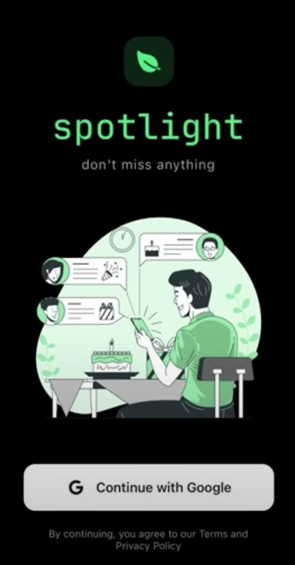
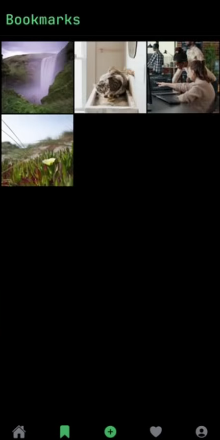
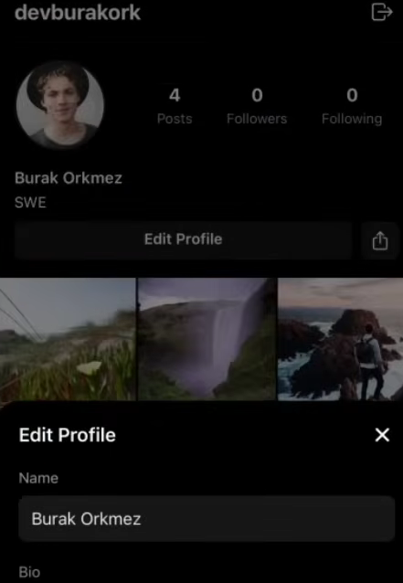

# 🌟 Adilight

**_Don’t miss anything_** — a clean, media-sharing app for discovering and saving highlights.

---

## 🚀 Overview

Adilight is a modern mobile app built using **Expo (React Native)** that allows users to:

- Browse image posts
- Create and share new posts
- Comment and interact in real-time
- Save favorite content to bookmarks

It combines **a sleek user experience** with **reliable real-time backend architecture**, offering a fully responsive and scalable image-first platform.

---

## 🧩 Tech Stack

| Layer            | Technology             |
|------------------|------------------------|
| **Frontend**     | React Native (Expo)    |
| **Backend**      | Convex (Realtime DB)   |
| **Authentication** | Clerk (OAuth via Google) |
| **Styling**      | Tailwind CSS-in-JS or custom styling |

---

## 📸 Screenshots & Feature Tour

### 🟢 1. Splash / Login Screen

  
> **"Continue with Google"** powered by Clerk for seamless OAuth login.

---

### 🔖 2. Bookmarks Tab

  
> Displays saved posts in a clean grid. Pull-to-refresh and navigation to user profiles supported.

---

### ➕ 3. New Post Screen

  
> Tap "+" → Select image → Add caption → Upload. Uses device media picker and saves post via Convex.

---

### 👥 4. User Profile (Other User)

  
> View another user's posts, follower count, and choose to follow them.

---

### 💬 5. Comments Section

  
> Real-time chat-like commenting system, auto-updating via Convex subscriptions.

---

### 👤 6. My Profile (Current User)

  
> Displays your posts and stats. Edit name and bio inline with smooth transitions.

---

## ✅ Key Features

| Feature              | Description |
|----------------------|-------------|
| **Authentication**   | Full onboarding and Google Sign-In via Clerk |
| **Backend Logic**    | Real-time DB and serverless functions with Convex |
| **Post Management**  | Create, view, delete, like, comment on posts |
| **Bookmarks**        | Save and organize favorite content |
| **User Profiles**    | View/edit profiles, follow/unfollow other users |
| **Real-time Comments** | Live comment threads via subscriptions |
| **Image Handling**   | Use native image picker and preview before posting |

---

## 🛠 Backend & Authentication Details

### 🔐 Clerk (Authentication)
- Handles user sign-in, sessions, and token management
- Integrated Google OAuth login
- Secure access and user context syncing

### 🧠 Convex (Backend & Realtime DB)
- Collections: `users`, `posts`, `comments`, `bookmarks`, `follows`
- Queries: Feed, Bookmarked Feed, Profile Posts, Comments per Post
- Mutations:
  - `addPost()`
  - `addComment()`
  - `toggleBookmark()`
  - `followUser()`
- Subscriptions enable real-time UI syncing

---

## 📁 Codebase Highlights

| Folder / File             | Purpose |
|---------------------------|---------|
| `screens/`                | Pages: `Home`, `Bookmarks`, `NewPost`, `Profile`, `Comments` |
| `components/`             | Reusable UI: `PostCard`, `CommentInput`, `ProfileHeader` |
| `convex/functions/`       | Business logic (mutations) |
| `convex/queries/`         | Data fetching (queries & subscriptions) |
| `contexts/AuthContext.tsx` | Clerk ↔ Convex identity management |

---

## 👋 Final Notes

Adilight is a lightweight yet fully-functional social media app that:

- Combines seamless UX with production-ready architecture
- Leverages cutting-edge tools like **Convex** & **Clerk**
- Demonstrates real-time interaction patterns in mobile development

